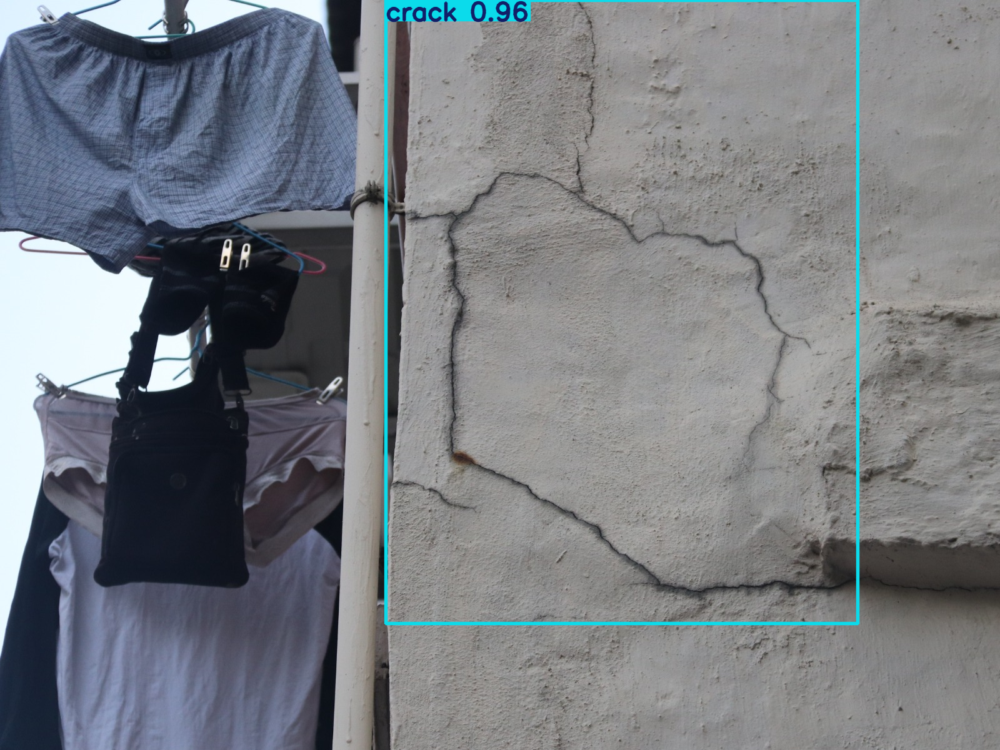

# 🧠 Real‑Time Crack Detection System

This project is a **full‑stack AI‑powered crack detection system**, built using:

- ⚙️ **Backend**: Python + FastAPI + YOLOv11-Large
- ⚛️ **Frontend**: React + TypeScript
- 🎯 Built for real-time image analysis and report generation

---

## 📸 Sample Output



## 🚀 Getting Started

### 1️ Clone the Repository

```bash
git clone https://github.com/AmanHayaat821898/crack-detection.git
cd crack-detection
```

### 2 Backend setup
```bash
cd Backend
python -m venv venv
source venv/bin/activate         # On Windows: venv\Scripts\activate
pip install -r requirements.txt
uvicorn main:app --reload
```


### 2 Frontend setup
```bash
cd Frontend
npm install
npm run dev
```

### 2 ENV setup
```bash
OPENAI_API_KEY='KEY'
```


